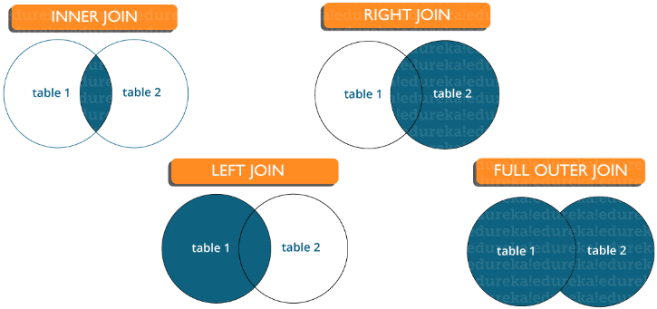

MyISAM поддерживает сжатие таблиц в отличии от InnoDB.
MyISAM имеет встроенные полнотекстный поиск в отличии от InnoDB.
InnoDB поддерживает транзакции в отличии от MyISAM.
InnoDB поддерживает блокировки уровня строки (MyISAM - только уровня таблицы).
InnoDB поддерживает ограничения внешних ключей (MyISAM - нет).
InnoDB более надежна при больших объемах данных.
InnoDB в теории немного быстрее.

# Из каких подмножеств состоит SQL?

* DDL (язык определения данных): в нем содержатся инструкции, необходимые для определения базы данных. CREATE, ALTER, DROP, TRUNCATE, RENAME и т. д. — вот несколько примеров.
* DML (язык манипулирования данными): включает в себя команды, необходимые для работы с данными в базе данных. Примеры включают SELECT, UPDATE, INSERT, DELETE и т. д.
* DCL (язык управления данными): включает команды, необходимые для работы с разрешениями пользователей и элементами управления системой базы данных. Например, GRANT и REVOKE.
* TCL (язык управления транзакциями): включает команды, которые необходимо использовать для управления транзакциями базы данных. Например, COMMIT, ROLLBACK и SAVEPOINT.

# Что подразумевается под СУБД? Какие существуют типы СУБД?

База данных — структурированная коллекция данных. Система управления базами данных (СУБД) — программное обеспечение, которое взаимодействует с пользователем, приложениями и самой базой данных для сбора и анализа данных. СУБД позволяет
пользователю взаимодействовать с базой данных. Данные, хранящиеся в базе данных, могут быть изменены, извлечены и удалены. Они могут быть любых типов, таких как строки, числа, изображения и т. д.

Существует два типа СУБД:

* Реляционная система управления базами данных: данные хранятся в отношениях (таблицах). Пример — MySQL.
* Нереляционная система управления базами данных: не существует понятия отношений, кортежей и атрибутов. Пример — Mongo.

# Что такое соединения в SQL?

Для соединения строк из двух или более таблиц на основе связанного между ними столбца используется оператор JOIN. Он используется для объединения двух таблиц или получения данных оттуда. В SQL есть 4 типа соединения, а именно:

* Inner Join (Внутреннее соединение)
* Right Join (Правое соединение)
* Left Join (Левое соединение)
* Full Join (Полное соединение)

# В чем разница между типом данных CHAR и VARCHAR в SQL?

И Char, и Varchar служат символьными типами данных, но varchar используется для строк символов переменной длины, тогда как Char используется для строк фиксированной длины. Например, char(10) может хранить только 10 символов и не сможет
хранить строку любой другой длины, тогда как varchar(10) может хранить строку любой длины до 10, т.е. например 6, 8 или 2.

# Что такое ограничения (Constraints)?

Ограничения (constraints) используются для указания ограничения на тип данных таблицы. Они могут быть указаны при создании или изменении таблицы. Пример ограничений:

* NOT NULL
* CHECK
* DEFAULT
* UNIQUE
* PRIMARY KEY
* FOREIGN KEY

# Что такое уникальный ключ (Unique key)?

* Однозначно идентифицирует одну строку в таблице.
* Допустимо множество уникальных ключей в одной таблице.
* Допустимы NULL-значения (прим. перевод.: зависит от СУБД, в SQL Server значение NULL может быть добавлено только один раз в поле с UNIQUE KEY).

# Что такое внешний ключ (Foreign key)?

* Внешний ключ поддерживает ссылочную целостность, обеспечивая связь между данными в двух таблицах.
* Внешний ключ в дочерней таблице ссылается на первичный ключ в родительской таблице.
* Ограничение внешнего ключа предотвращает действия, которые разрушают связи между дочерней и родительской таблицами.

# В чем разница между кластеризованным и некластеризованным индексами в SQL?

Различия между кластеризованным и некластеризованным индексами в SQL:

* Кластерный индекс используется для простого и быстрого извлечения данных из базы данных, тогда как чтение из некластеризованного индекса происходит относительно медленнее.
* Кластеризованный индекс изменяет способ хранения записей в базе данных — он сортирует строки по столбцу, который установлен как кластеризованный индекс, тогда как в некластеризованном индексе он не меняет способ хранения, но создает
  отдельный объект внутри таблицы, который указывает на исходные строки таблицы при поиске.
* Одна таблица может иметь только один кластеризованный индекс, тогда как некластеризованных у нее может быть много.

# Напишите SQL-запрос для отображения текущей даты.

В SQL есть встроенная функция GetDate (), которая помогает возвращать текущий timestamp/дату.

# Перечислите типы соединений



* Inner join (Внутреннее соединение): в MySQL является наиболее распространенным типом. Оно используется для возврата всех строк из нескольких таблиц, для которых выполняется условие соединения.
* Left Join (Левое соединение): в MySQL используется для возврата всех строк из левой (первой) таблицы и только совпадающих строк из правой (второй) таблицы, для которых выполняется условие соединения.
* Right Join (Правое соединение): в MySQL используется для возврата всех строк из правой (второй) таблицы и только совпадающих строк из левой (первой) таблицы, для которых выполняется условие соединения.
* Full Join (Полное соединение): возвращает все записи, для которых есть совпадение в любой из таблиц. Следовательно, он возвращает все строки из левой таблицы и все строки из правой таблицы.

# Что такое индекс?

Индексы относятся к методу настройки производительности, позволяющему быстрее извлекать записи из таблицы. Индекс создает отдельную структуру для индексируемого поля и, следовательно, позволяет быстрее получать данные.

# Опишите различные типы индексов.

Есть три типа индексов, а именно:

* Уникальный индекс (Unique Index): этот индекс не позволяет полю иметь повторяющиеся значения, если столбец индексируется уникально. Если первичный ключ определен, уникальный индекс может быть применен автоматически.
* Кластеризованный индекс (Clustered Index): этот индекс меняет физический порядок таблицы и выполняет поиск на основе значений ключа. Каждая таблица может иметь только один кластеризованный индекс.
* Некластеризованный индекс (Non-Clustered Index): не изменяет физический порядок таблицы и поддерживает логический порядок данных. Каждая таблица может иметь много некластеризованных индексов.

# Что такое свойство ACID в базе данных?

ACID означает атомарность (Atomicity), согласованность (Consistency), изолированность (Isolation), долговечность (Durability). Он используется для обеспечения надежной обработки транзакций данных в системе базы данных.

* Атомарность. Гарантирует, что транзакция будет полностью выполнена или потерпит неудачу, где транзакция представляет одну логическую операцию данных. Это означает, что при сбое одной части любой транзакции происходит сбой всей транзакции
  и состояние базы данных остается неизменным.
* Согласованность. Гарантирует, что данные должны соответствовать всем правилам валидации. Проще говоря, вы можете сказать, что ваша транзакция никогда не оставит вашу базу данных в недопустимом состоянии.
* Изолированность. Основной целью изолированности является контроль механизма параллельного изменения данных.
* Долговечность. Долговечность подразумевает, что если транзакция была подтверждена (COMMIT), произошедшие в рамках транзакции изменения сохранятся независимо от того, что может встать у них на пути (например, потеря питания, сбой или
  ошибки любого рода).

# Что вы подразумеваете под «триггером» в SQL?

Триггер в SQL — особый тип хранимых процедур, которые предназначены для автоматического выполнения в момент или после изменения данных. Это позволяет вам выполнить пакет кода, когда вставка, обновление или любой другой запрос выполняется к
определенной таблице.

# Какие операторы доступны в SQL?

* Арифметические Операторы
* Логические Операторы
* Операторы сравнения

# В чем разница между перекрестным (cross join) и естественным (natural join) соединением?

Перекрестное соединение создает перекрестное или декартово произведение двух таблиц, тогда как естественное соединение основано на всех столбцах, имеющих одинаковое имя и типы данных в обеих таблицах.

# Почему не выполнится этот запрос?

```mysql
SELECT user_name,
       YEAR(user_birth_date) AS year_of_birth
FROM users
WHERE year_of_birth = 2000
```

Запрос не выполнится из-за обращения к псевдониму year_of_birth в выражении WHERE. Дело в том, что псевдонимы полей в SQL используются для форматирования данных уже полученных из базы. Поэтому их можно использовать только в выражениях,
которые отвечают за оформление результата, таких как GROUP BY, ORDER BY и HAVING. В выражениях, отвечающих за получение данных, таких как WHERE, нужно использовать оригинальные имена полей.

```mysql
WHERE
	YEAR(user_birth_date) = 2000
```

# Какая разница между TRUNCATE TABLE table_name и DELETE FROM table_name?

* При вызове команды TRUNCATE таблица полностью сбрасывается и создается снова, в то время как команда DELETE удаляет каждую строку таблицы по отдельности. Из-за этого TRUNCATE отрабатывает значительно быстрее.
* Как следствие первого пункта, команда TRUNCATE не вызывает срабатывание триггеров и правил внешних ключей, то есть, очищая таблицу таким способом, можно не бояться каскадного удаления или изменения данных в других таблицах.
* В отличие от DELETE команда TRUNCATE не транзакционная. То есть, если в момент ее вызова, таблица table_name будет заблокирована какой-либо транзакцией — может возникнуть ошибка.

# Какая разница между UNION и UNION ALL?

Разница между ними заключается в том, что, если в результатах запросов есть одинаковые строки, то UNION удалит дубликаты, оставив только одну из таких строк. В то же время UNION ALL, как можно догадаться из названия, просто объединит
результаты запросов, не обращая внимания на дубликаты.

# Какая разница между выражениями WHERE и HAVING?

Выражения WHERE и HAVING используются для фильтрации результата запроса и ожидают после себя некоторое условие, по которому нужно отфильтровать данные. Но, если WHERE работает само по себе и фильтрует данные каждой строки результата по
отдельности, то выражение HAVING имеет смысл только в сочетании с выражением GROUP BY и фильтрует уже сгруппированные значения.

# Зачем нужны операторы UNION, MINUS и INTERSECT?

* Оператор UNION отвечает за объединение строк из обоих подзапросов;
* Оператор MINUS отвечает за вычитание результатов одного подзапроса из результатов второго подзапроса;
* Оператор INTERSECT отвечает за пересечение строк из обоих подзапросов.

## Перед выполнением любого из приведенных выше инструкций в SQL, необходимо выполнить определенные условия:

* Каждый оператор SELECT в предложении должен иметь одинаковое количество столбцов;
* Столбцы также должны иметь аналогичные типы данных;
* Столбцы в каждой инструкции SELECT обязательно должны иметь одинаковый порядок.

# Что такое курсор?

Курсор в SQL – это область в памяти базы данных, которая предназначена для хранения последнего оператора SQL. Если текущий оператор – запрос к базе данных, в памяти сохраняется и строка данных запроса, называемая текущим значением, или
текущей строкой курсора.

# Перечислите различные типы связей в SQL.

* One-to-One - этот тип может быть определён как отношение между двумя таблицами, где каждая запись в одной таблице связана максимум с одной записью в другой таблице.
* One-to-Many & Many-to-One - это наиболее часто используемое отношение, когда запись в таблице связана с несколькими записями в другой таблице.
* Many-to-Many - этот тип используется в случаях, когда для определения отношения требуется несколько экземпляров с обеих сторон.
* Self-Referencing Relationships - этот тип используется, когда таблице необходимо определить связь с самой собой.

# Что такое нормализация?

Нормализация — это процесс организации данных в базе данных, включающий создание таблиц и установление отношений между ними в соответствии с правилами, которые обеспечивают защиту данных и делают базу данных более гибкой, устраняя
избыточность и несогласованные зависимости.

# Что такое подстановочные знаки?

Это специальные символы, которые нужны для замены каких-либо знаков в запросе. Они используются вместе с оператором LIKE, с помощью которого можно отфильтровать запрашиваемые данные.

# Что такое агрегатные и скалярные функции?

Агрегатная функция выполняет вычисление над набором значений и возвращает одно значение. В табличной модели данных это значит, что функция берет ноль, одну или несколько строк для какой-то колонки и возвращает единственное значение. Для
сравнения — скалярные функции принимают на вход одно значение и возвращают одно значение.

## Примеры агрегатных функций:

* AVG() - Функция вычисляет среднее значение
* MAX() - Функция вычисляет элемент с максимальным значением
* MIN() - Функция вычисляет элемент с минимальным значением
* SUM() - Функция суммирует значения

## Примеры скалярных функций:

* LEN() - Функция вычисляет общую длину поля
* MID() - Функция извлекает подстроки из набора строковых значений в таблице
* RAND() - Функция генерирует случайный набор чисел заданной длины
* NOW() - Функция возвращает текущую дату и время

# Что такое OLTP?

OLTP - это транзакционные системы, то есть системы, ориентированные на быстрое добавление транзакций (операций) и, возможно, их изменения.

# В чём различия между OLTP и OLAP?

OLTP-это система обработки транзакций, то есть она управляет приложениями, основанными на транзакциях, через Интернет. Например, системы OLTP отвечают за предоставление данных в хранилища данных. С другой стороны, OLAP-это система
аналитической обработки. Это означает, что она отвечает на многомерные аналитические запросы, соответствующие финансовой отчетности, прогнозированию и т.д. Например, данные, доступные в хранилище данных, анализируются с помощью
OLAP-системы.

# Что такое сопоставление?

Сопоставление в SQL — это ряд правил, согласно которым сортируются и сравниваются данные. Эти правила определяют порядок сортировки символьных данных, в зависимости от регистра, надстрочных знаков (акцента), символьных типов Kana, ширины
символов.

# Что такое хранимая процедура?

Хранимая процедура - это объект базы данных, представляющий собой набор SQL-инструкций, который компилируется один раз и хранится на сервере. Хранимые процедуры очень похожи на обыкновенные процедуры языков высокого уровня, у них могут быть
входные и выходные параметры и локальные переменные, в них могут производиться числовые вычисления и операции над символьными данными, результаты которых могут присваиваться переменным и параметрам.

# Что такое рекурсивная хранимая процедура?

Рекурсивная хранимая процедура - это хранимая процедура, которая вызывает сама себя.

# Как создать пустые таблицы с той же структурой, что и у другой таблицы?

Создание пустых таблиц с одинаковой структурой может быть выполнено путём извлечения записей из одной таблицы в новую таблицу с помощью оператора INTO, установив при этом значение WHERE для всех записей равным false. Следовательно, SQL
подготавливает новую таблицу с повторяющейся структурой для приема извлечённых записей, но поскольку никакие записи не извлекаются из-за действия предложения WHERE, в новую таблицу ничего не вставляется.

```mysql
SELECT *
INTO Students_copy
FROM Students
WHERE 1 = 2;
```

# Что такое сопоставление шаблонов в SQL?

Сопоставление шаблонов SQL позволяет искать шаблоны в данных, если вы не знаете точное слово или фразу, которую ищете. Этот тип SQL - запроса использует подстановочные знаки для соответствия шаблону, а не точное его указание. Например, вы
можете использовать подстановочный знак "C%" для соответствия любой строке, начинающейся с заглавной С .

# Что такое PostgreSQL?

PostgreSQL — это реляционная база данных

# Как изменить тип данных столбца?

Это можно сделать с помощью инструкции ALTER TABLE, как показано ниже:

```mysql
ALTER TABLE tname
    ALTER COLUMN col_name [SET DATA] TYPE new_data_type;
```

# Что такое строковые константы в PostgreSQL?

Строковые константы представляют собой последовательности символов, заключенные в одинарные кавычки. Они используются при вставке данных или обновлении символов в базе данных.Существуют специальные строковые константы, которые указаны в
долларах. Синтаксис: $tag$$tag$ Тег в константе необязателен, и когда мы не указываем тег, константа называется строковым литералом с двойным долларом.

# Поддерживает ли PostgreSQL полнотекстовый поиск?

Полнотекстовый поиск - это метод поиска одного документа или коллекции документов, хранящихся на компьютере, в полнотекстовой базе данных. В основном он поддерживается в продвинутых системах баз данных, таких как SOLR или ElasticSearch. Тем
не менее, эта функция присутствует, но довольно проста в PostgreSQL.

# В чём разница между commit и checkpoint?

Действие commit обеспечивает сохранение согласованности данных транзакции и завершает текущую транзакцию в разделе. Commit добавляет в журнал новую запись, описывающую фиксацию в памяти. Checkpoint используется для записи всех изменений

# Описать Различные Уровни Абстракции Данных СУБД.

Абстракция данных скрывает от пользователя неважную информацию, чтобы обеспечить более плавное взаимодействие. Существуют три уровня абстракции:

* Физический уровень: наименьший уровень абстракции описывает физическое хранение данных в памяти. Для доступа к данным могут использоваться как последовательные, так и произвольные методы доступа. Для упорядочивания файлов используются
  B+-деревья и методы хеширования.
* Логический уровень: Уровень, на котором данные хранятся в виде таблиц. Кроме того, базовые структуры используются для хранения связей между различными элементами.
* Уровень просмотра: это самый высокий уровень абстракции. Пользователям доступна только часть реальной базы данных, представленная строками и столбцами. Возможно несколько представлений одной и той же базы данных. Пользователей не
  уведомляют об особенностях хранения и реализации.

# Как получить общие записи из двух таблиц?

```mysql
Select studentID
from student INTERSECT Select StudentID
from Exam
```

# Как получить альтернативные записи из таблицы?

Записи могут быть получены как для нечетных, так и для четных номеров строк.

```mysql
Select studentId
from (Select rowno, studentId from student)
where mod(rowno, 2) = 0
```

```mysql
Select studentId
from (Select rowno, studentId from student)
where mod(rowno, 2) = 1
```

# Как выбрать уникальные записи из таблицы?

```mysql
Select DISTINCT StudentID, StudentName
from Student.
```

# Какая команда используется для получения первых 5 символов строки?

```mysql
Select SUBSTRING(StudentName, 1, 5) as studentname
from student
Select LEFT(Studentname, 5) as studentname
from student
```

# Какой оператор используется в запросе на сопоставление с образцом?

* % – соответствует нулю или более символам.
* _(Подчеркивание) – соответствует ровно одному символу.
